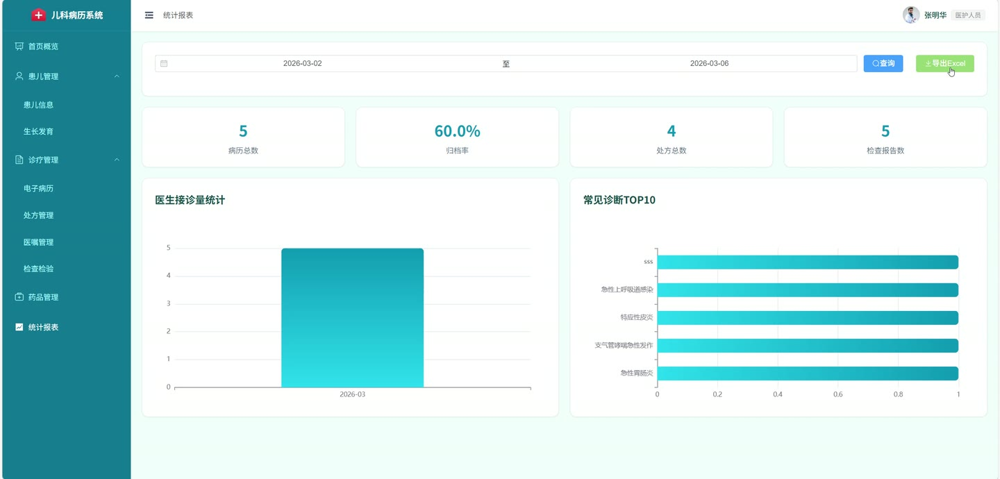
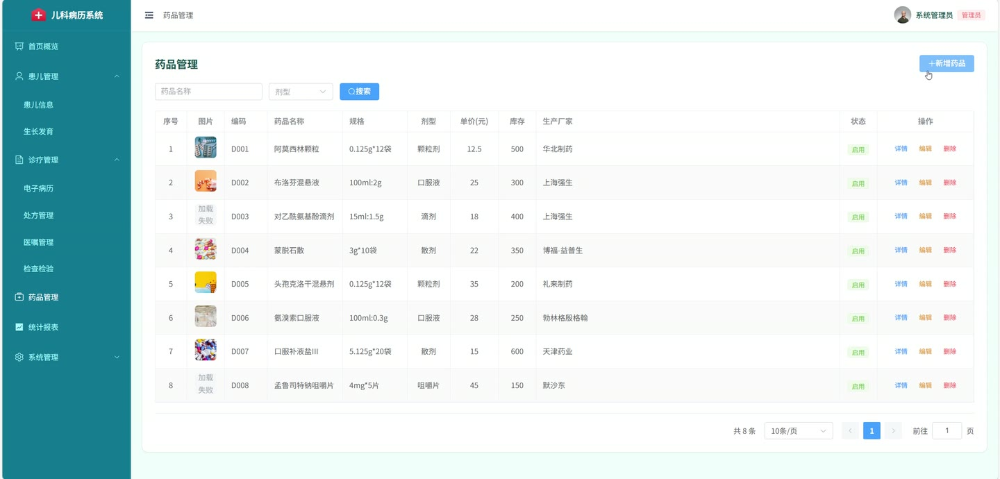
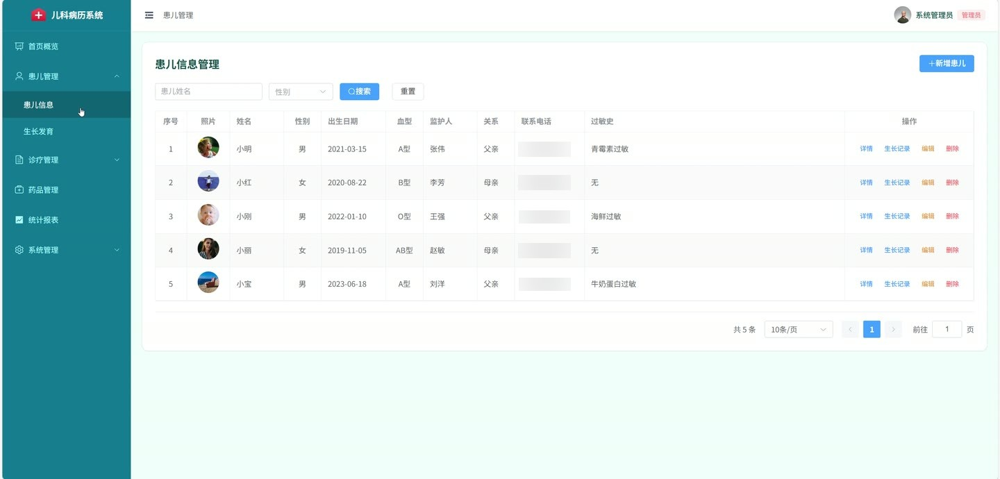
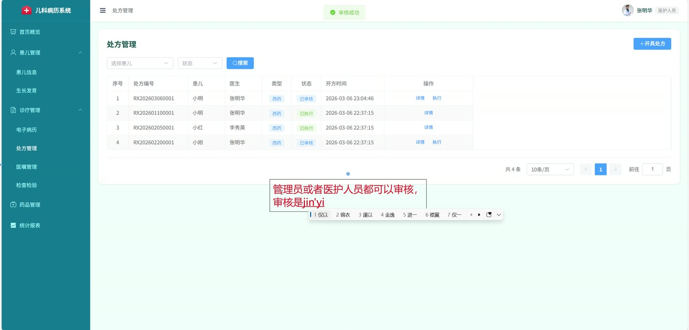
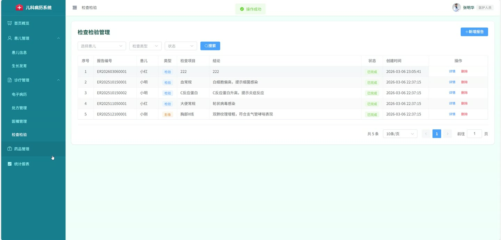

# (附文档)Springboot3+Vue3+MySQL 儿科电子病历管理系统

**技术栈**：Springboot3、Vue3、MySQL

### 系统简介

基于 Spring Boot 3 + Vue 3 + MySQL 的儿科电子病历管理系统，采用前后端分离架构。系统面向管理员与医护人员两个角色，涵盖患儿档案管理、电子病历书写、处方开具、医嘱下达执行、检查检验报告管理、生长发育记录跟踪、统计报表分析及基础字典维护等核心业务环节。
 
### 核心功能
 
### 管理员

 
- 用户管理：分页查询医护人员列表（支持按真实姓名/角色筛选），新增医护人员（默认密码 123456，MD5 加密存储），编辑用户信息（不可修改密码字段），删除用户，重置用户密码为 123456，启用/禁用用户账号。 
- 病症库管理：分页查询常见病症（支持按病症名称/分类筛选），新增/编辑/删除病症（字段包括 ICD-10 编码、病症名称、分类、描述、常见症状、启用状态）。 
- 检查项目管理：分页查询检查项目（支持按项目名称/检查类型筛选），新增/编辑/删除检查项目（字段包括项目编码、项目名称、检查类型、费用、参考值范围、单位、启用状态）。 
- 操作日志查看：分页查询操作日志（支持按用户名/操作模块/操作类型筛选），清空全部日志。
 
### 医护人员

 
- 患儿信息管理：分页查询患儿列表（支持按姓名/性别筛选），新增/编辑/删除患儿档案（字段包括姓名、性别、出生日期、身份证号、照片、血型、监护人信息、家庭住址、过敏史、既往病史）。 
- 生长发育记录：按患儿分页查询生长发育记录，新增记录（自动计算 BMI 值），删除记录，查看生长曲线数据（按记录日期升序排列）。 
- 电子病历管理：分页查询病历（支持按患儿/医生/诊断/状态筛选），新增病历（自动生成 MR+年月日+4位序号 的编号，默认草稿状态），编辑/删除病历，提交病历（状态变为已提交），归档病历（状态变为已归档）。 
- 处方管理：分页查询处方（支持按患儿/医生/状态筛选），创建处方（同时保存处方主表与处方明细，自动生成 MO+年月日+4位序号 编号），查看处方详情（含药品明细），审核处方（状态变为已审核），执行处方（状态变为已执行），取消处方（状态变为已取消），根据药品 ID、年龄（月数）、体重计算儿童用药剂量。 
- 医嘱管理：分页查询医嘱（支持按患儿/医生/状态筛选），下达医嘱（自动生成 MO+年月日+4位序号 编号，默认待执行状态），编辑/删除医嘱，执行医嘱（记录执行人 ID 与执行时间，状态变为执行中），完成医嘱（状态变为已完成），停止医嘱（状态变为已停止）。 
- 检查检验报告管理：分页查询报告（支持按患儿/检查类型/状态筛选），新增报告（自动生成 ER+年月日+4位序号 编号，默认待检查状态），编辑/删除报告，完成报告（状态变为已完成）。 
- 统计报表：查看首页仪表盘统计（患儿总数、今日就诊数、病历总数、处方总数、医生数量、药品数量），医生接诊量统计（支持按医生和时间范围筛选），常见诊断占比统计（支持时间范围筛选），医疗质量指标（支持时间范围筛选），抗生素使用率统计（支持时间范围筛选），导出统计报表 Excel（包含患儿总数、今日就诊数等基本指标及常见诊断 TOP10）。 
- 药品管理：分页查询药品列表（支持按药品名称/剂型筛选），新增/编辑/删除药品（字段包括药品编码、药品名称、通用名、规格、剂型、单位、单价、库存、生产厂家、适用年龄范围、儿童用药说明、图片、启用状态）。 
- 个人中心：修改个人密码（需验证原密码）。 
- 文件上传：上传任意文件（返回文件 URL），上传图片（限制仅能上传图片格式文件）。
 
### 技术栈

 后端框架Spring Boot 3.x ORMMyBatis-Plus（含分页插件、自动填充、逻辑删除） 权限路由级角色校验（admin 属性） 前端框架Vue 3（Composition API） 状态管理Vue Router（路由守卫 + 延迟加载） 构建工具Vite 数据库MySQL 8.x 其他Jackson（时间格式定制）、Hutool（MD5 加密）、跨域 CORS 配置、全局异常处理
 
### 交付内容

 
- 后端完整源码 
- 前端完整源码 
- 数据库初始化脚本 
- 万字文档

## 界面展示

---

## 获取完整源码 + 万字文档

本仓库为项目介绍页。**完整前后端源码、数据库初始化脚本、万字项目文档**，请加微信 `kangkangcode`，或访问 [codekk.top](http://codekk.top) 获取。

可作课程设计 / 毕业设计参考，支持远程部署调试。